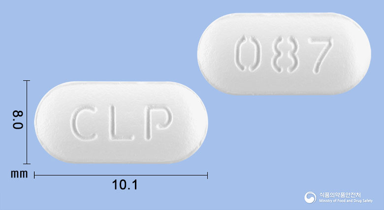
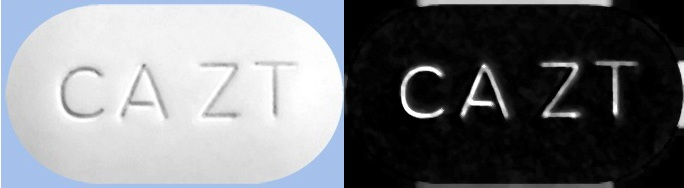
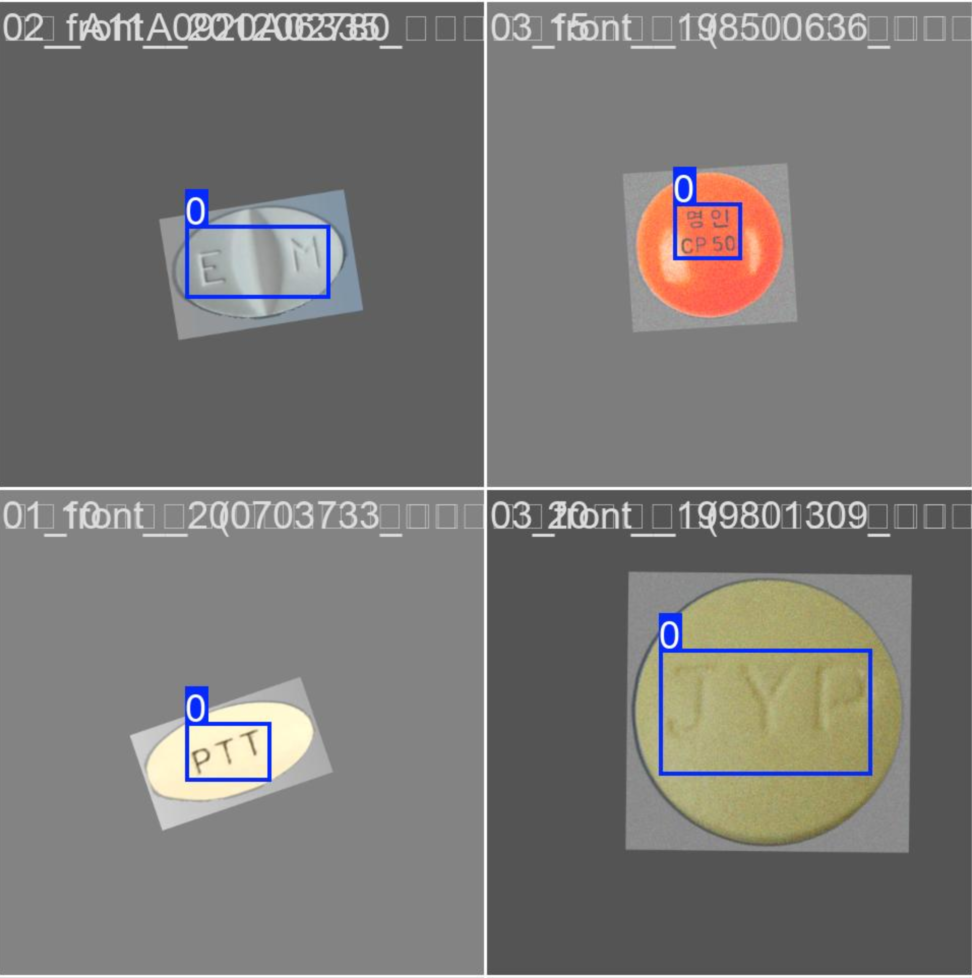
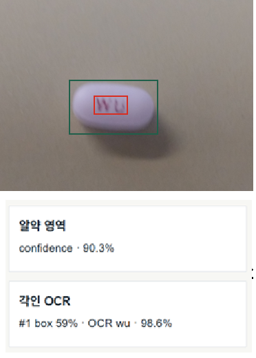

# 알약 각인

## 알약 각인 데이터 준비
  

  원시 데이터의 형태: 알약의 앞 뒤면이 하나의 이미지에 포함되어있고 배경이
  푸른색 계열의 단일 또는 눈금자가 있는 약 2만7천장의 이미지 파일

1. 배경 처리 도구로 일괄 배경 색만 제거
   
2. 알약 앞면 뒷면 을 두 개의 파일로 분리
   - 수직, 수평 중심 부근 기준
   - 두 대각선 방향쪽 기준
  
3. 음각 문자를 OCR모델이 잘 인식 할 수 있도록 전처리 
   - Gray scale
   - Sharpening
   - BlackHat 
   

3. 각인 부분 라벨링
   -  물체 인식을 하기위해 훈련된 모델을 이용해 알약의 위치 파악
   -  알약 영역 부분에서 임의 시작점 + 등고선 방법을 이용해 각인 영역을 OCR 모델을 이용해 탐지
  
4. 데이터를 눈으로 직접확인하며 잘못된 데이터는 거르기
   - 데이터 개수를 늘리는 것보다 잘못된 라벨링이 없는 데이터가 학습에 유리

## 알약 각인 영역 모델 훈련 
  
  <!--  -->

  각인은 섬세한 정보를 훈련하는 것이 중요. 
  전체 데이터를 학습/검증/테스트 데이터의 양 7/2/1 비율로 분리.
  탐지할 객체가 없는 케이스도 학습이 필요하므로 각 학습/검증/테스트 별 각각 데이터에 필수 10%~20% 비율. 

  - YOLO11 (CNN기반 모델)을 베이스로 설정
  
  - 섬세한 특징이 중요하기 때문에 기존의 가중치는 모두 훈련 가능하도록 설정
  
  - 이미지 크기를 640x640 또는 960x960으로 변환하여 학습. 이 과정에서 가로x세로 비율이 찌그러지지 않도록 패딩 후 변환
  
  - 훈련중 과적합 및 배경 이미지 학습을 방지하기 위한 데이터 증강 기법 사용
    - 위치, 회전, 노이즈, Blurr, 이미지 HSV값 임의 변경
    - 배경부분 색상의 임의 변경

## 알약 각인 OCR 모델 및 훈련

  - [CRNN](https://github.com/GitYCC/crnn-pytorch) 모델:  CNN은 이미지 특징추출 + RNN은 각 특징들 간의 문맥 파악
  - [Synth90k](https://www.kaggle.com/datasets/allahhitler/ocr-synthetic-dataset) 데이터 셋에 미리 훈련된 모델 사용

## 알약 각인 예측
  
  <!--  -->

1. 사용자가 입력한 이미지에서 알약 영역만을 잘라내는 모델로 알약의 위치 파악 
2. 파악된 위치 영역 내부에서 각인 영역을 훈련된 모델로 예측
3. 각인 영역위에서 OCR모델을 이용하여 각인 값 예측